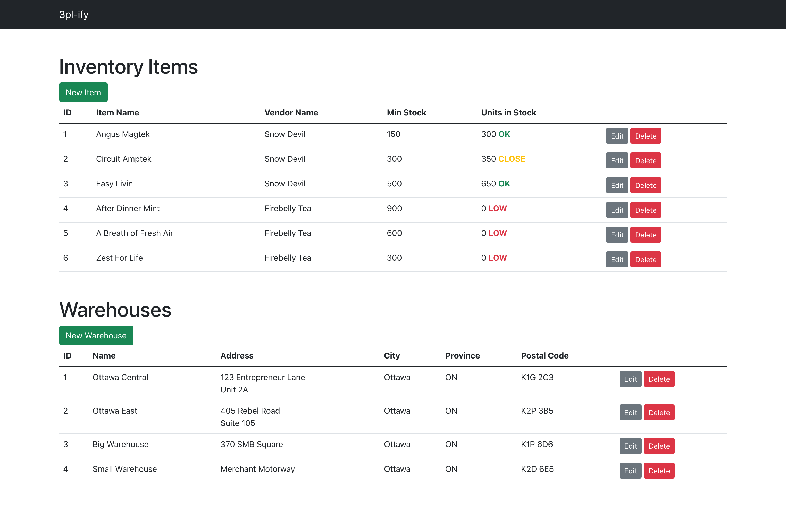
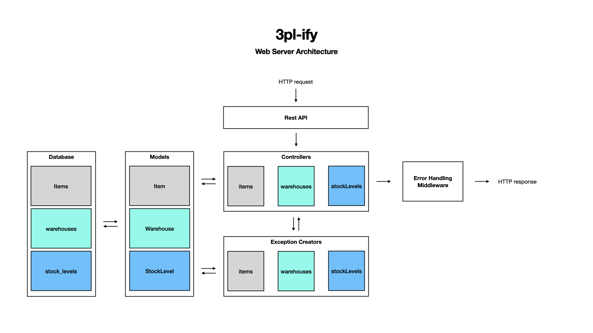

# 3pl-ify

Inventory tracking web application written in JavaScript.



<details>
  <summary><strong>Table of Contents</strong></summary>
  <ol>
    <li>
      <a href="#about-the-project">About the Project</a>
      <ul>
        <li>
          <a href="#server-architecture">Server Architecture</a>
        </li>
        <li>
          <a href="#features">Features</a></li>
          <ul>
            <li><a href="#items">Items</a></li>
            <li><a href="#warehouses">Warehouses</a></li>
            <li><a href="#items-warehouses">Items-Warehouses</a></li>
          </ul>
        </li>
        <li>
          <a href="#built-with">Built With</a>
          <ul>
            <li><a href="#server">Server</a></li>
            <li><a href="#client">Client</a></li>
          </ul>
        </li>
      </ul>
    </li>
    <li>
      <a href="#getting-started">Getting Started</a>
      <ul>
        <li><a href="#prerequisites">Prerequisites</a></li>
        <li><a href="#installation-and-setup">Installation and Setup</a></li>
      </ul>
    </li>
    <li>
      <a href="#api-documentation">REST API documentation</a>
       <ul>
        <li><a href="#items-api">Items</a></li>
        <li><a href="#warehouses-api">Warehouses</a></li>
        <li><a href="#stocklevel-api">Stock Levels</a></li>
      </ul>
    </li>
  </ol>
</details>

## About the Project

3PL-ify is an inventory tracking web application built for a logistics company. The server application supports CRUD operations on inventory and warehouses, as well as the allocation of inventory to warehouses.

**My focus in developing this application was a _high degree of modularity_, to support the addition of features in the future** (e.g., extending the data model and API to include Vendors, Shipments and Metadata).

This project also includes a basic client application to demo the functionality of the server application.

### Server Architecture



### Features

#### Items

1. Create a inventory item
2. View a list of all inventory items
3. View a specific inventory item
4. Edit an inventory item
5. Delete an inventory item

#### Warehouses

1. Create a warehouse
2. View a list of all warehouses
3. View a specific warehouse
4. Edit a warehouse
5. Delete a warehouse

#### Stock Levels

Stock Levels allow you to allocate items of inventory to specific warehouses. A StockLevel represent a number of units of a specific item in a specific warehouse.

1. Create a StockLevel
2. Create an adjustment to the inventory level for an existing StockLevel
3. Set the inventory level for an existing StockLevel

### Built With

This application is written entirely in JavaScript.

#### Server

- [Express](http://expressjs.com/) as the framework for the server application
- [PostgreSQL](https://www.postgresql.org/) as the relational database management system
- [Sequelize](https://sequelize.org/) as the ORM tool for modelling and interaction with the PostgreSQL database

#### Client

- [React](https://reactjs.org/) as the library for the intreactive user interface
- [Create React App](https://create-react-app.dev/) to streamline the configuration, transpilation and building of the React application
- [React Bootstrap](https://react-bootstrap.github.io/) for pre-built, Bootstrap-styled React components
- [Axios](https://axios-http.com/) as an HTTP client

---

## Getting Started

### Prerequisites

You will need the following installed in your environment:

1. [Node.js](https://nodejs.org/en/)
2. [npm](https://www.npmjs.com/package/npm)
3. [PostgreSQL](https://www.postgresql.org/download/)

### Installation and Setup

Create the PostgreSQL database (commands may differ by operating system):

```bash
psql
CREATE DATABASE inventory;
\q
```

Create a `.env` file in the `server` directory with your PostgreSQL database local [connection string](https://www.postgresql.org/docs/current/libpq-connect.html#LIBPQ-CONNSTRING) (may differ by local configuration):

```bash
# Example connection string; may differ by local configuration
echo "PG_URI=postgres://localhost:5432/inventory" > server/.env
```

Change into the `server` directory, install dependencies and seed the database with sample data:

```bash
cd server
npm install
npm run seed
```

Change into the `client` directory and install dependencies:

```bash
cd ../client
npm install
```

#### Run the Application Locally

In one terminal, start the development server:

```bash
cd server
npm run dev
```

In a separate terminal, start the client application:

```bash
cd client
npm start
```

Open [http://localhost:3000](http://localhost:3000) to view it in your browser.

---

## REST API Documentation

Base URL: `/api`

### Items API

#### `POST /api/items`

Creates a new inventory item

##### Body Parameters

| Parameter    | Type    | Required | Default | Description                      |
| :----------- | :------ | :------- | :------ | :------------------------------- |
| `name`       | string  | yes      | none    | name of the item                 |
| `minStock`   | integer | yes      | 0       | minimum stock level (at least 0) |
| `vendorName` | string  | yes      | none    | name of vendor                   |

#### Sample Response

`Status: 201 Created`

```json
{
  "newItem": {
    "id": 7,
    "name": "Circuit Amptek",
    "minStock": 200,
    "vendorName": "Snow Devil",
    "updatedAt": "2022-01-19T22:28:59.884Z",
    "createdAt": "2022-01-19T22:28:59.884Z"
  }
}
```

#### `GET /api/items`

Retrieves a list of all inventory items

#### Sample Response

`Status: 200 OK`

```json
{
  "items": [
    {
      "id": 1,
      "name": "Angus Magtek",
      "vendorName": "Snow Devil",
      "minStock": 150,
      "createdAt": "2022-01-19T21:04:34.879Z",
      "updatedAt": "2022-01-19T21:04:34.879Z"
    },
    {
      "id": 2,
      "name": "Circuit Amptek",
      "vendorName": "Snow Devil",
      "minStock": 300,
      "createdAt": "2022-01-19T21:04:34.889Z",
      "updatedAt": "2022-01-19T21:04:34.889Z"
    },
    {
      "id": 3,
      "name": "Easy Livin",
      "vendorName": "Snow Devil",
      "minStock": 500,
      "createdAt": "2022-01-19T21:04:34.911Z",
      "updatedAt": "2022-01-19T21:04:34.911Z"
    }
  ]
}
```

#### `GET /api/items/{itemId}`

Retrieves a single inventory item

##### Path Parameters

| Parameter | Type    | Required | Default | Description                       |
| :-------- | :------ | :------- | :------ | :-------------------------------- |
| `itemId`  | integer | yes      | none    | `id` of the item you are querying |

##### Sample Response

`Status: 200 OK`

```json
{
  "item": {
    "id": 1,
    "name": "Angus Magtek",
    "vendorName": "Snow Devil",
    "minStock": 150,
    "createdAt": "2022-01-19T21:04:34.879Z",
    "updatedAt": "2022-01-19T21:04:34.879Z"
  }
}
```

#### `PUT /api/items/{itemId}`

Updates an entire inventory item record

##### Path Parameters

| Parameter | Type    | Required | Default | Description                       |
| :-------- | :------ | :------- | :------ | :-------------------------------- |
| `itemId`  | integer | yes      | none    | `id` of the item you are updating |

##### Body Parameters

| Parameter    | Type    | Required | Default | Description                      |
| :----------- | :------ | :------- | :------ | :------------------------------- |
| `name`       | string  | yes      | none    | name of the item                 |
| `minStock`   | integer | yes      | 0       | minimum stock level (at least 0) |
| `vendorName` | string  | yes      | none    | name of vendor                   |

##### Sample Response

`Status: 204 No Content`

#### `DELETE /api/items/{itemId}`

Deletes an inventory item

##### Path Parameters

| Parameter | Type    | Required | Default | Description                       |
| :-------- | :------ | :------- | :------ | :-------------------------------- |
| `itemId`  | integer | yes      | none    | `id` of the item you are deleting |

##### Sample Response

`Status: 204 No Content`

### Warehouses API

#### `POST /api/warehouses`

Creates a new warehouse

##### Body Parameters

| Parameter       | Type   | Required | Default | Description                                                   |
| :-------------- | :----- | :------- | :------ | :------------------------------------------------------------ |
| `name`          | string | yes      | none    | name of the warehouse                                         |
| `adddressLine1` | string | yes      | none    | street address                                                |
| `adddressLine2` | string | no       | none    | unit #, suite #, etc.                                         |
| `city`          | string | yes      | none    | city of the warehouse                                         |
| `province`      | string | yes      | none    | province of the warehouse (official 2-letter abbreviation     |
| `postalCode`    | string | yes      | none    | postal code of the warehouse, including space (e.g., A1B 2C3) |

#### Sample Response

`Status: 201 Created`

```json
{
  "newWarehouse": {
    "id": 5,
    "name": "Toronto North",
    "addressLine1": "123 Warehouse Lane",
    "addressLine2": "Suite 5A",
    "city": "Toronto",
    "province": "ON",
    "postalCode": "A1B 2C3",
    "updatedAt": "2022-01-19T22:40:31.182Z",
    "createdAt": "2022-01-19T22:40:31.182Z"
  }
}
```

#### `GET /api/warehouses`

Retrieves a list of all warehouses

#### Sample Response

`Status: 200 OK`

```json
{
  "warehouses": [
    {
      "id": 1,
      "name": "Ottawa Central",
      "addressLine1": "123 Entrepreneur Lane",
      "addressLine2": "Unit 2A",
      "city": "Ottawa",
      "province": "ON",
      "postalCode": "K1G 2C3",
      "createdAt": "2022-01-19T20:04:15.725Z",
      "updatedAt": "2022-01-19T20:04:15.725Z"
    },
    {
      "id": 2,
      "name": "Ottawa East",
      "addressLine1": "405 Rebel Road",
      "addressLine2": "Suite 105",
      "city": "Ottawa",
      "province": "ON",
      "postalCode": "K2P 3B5",
      "createdAt": "2022-01-19T20:04:15.727Z",
      "updatedAt": "2022-01-19T20:04:15.727Z"
    },
    {
      "id": 3,
      "name": "Big Warehouse",
      "addressLine1": "370 SMB Square",
      "addressLine2": null,
      "city": "Ottawa",
      "province": "ON",
      "postalCode": "K1P 6D6",
      "createdAt": "2022-01-19T20:04:15.728Z",
      "updatedAt": "2022-01-19T20:04:15.728Z"
    }
  ]
}
```

#### `GET /api/warehouses/{warehouseId}`

Retrieves a single warehouse

##### Path Parameters

| Parameter     | Type    | Required | Default | Description                            |
| :------------ | :------ | :------- | :------ | :------------------------------------- |
| `warehouseId` | integer | yes      | none    | `id` of the warehouse you are querying |

##### Sample Response

`Status: 200 OK`

```json
{
  "warehouse": {
    "id": 5,
    "name": "Toronto North",
    "addressLine1": "123 Warehouse Lane",
    "addressLine2": "Suite 5A",
    "city": "Toronto",
    "province": "ON",
    "postalCode": "A1B 2C3",
    "createdAt": "2022-01-19T22:40:31.182Z",
    "updatedAt": "2022-01-19T22:40:31.182Z"
  }
}
```

#### `PUT /api/warehouses/{warehouseId}`

Updates an entire warehouse record

##### Path Parameters

| Parameter     | Type    | Required | Default | Description                            |
| :------------ | :------ | :------- | :------ | :------------------------------------- |
| `warehouseId` | integer | yes      | none    | `id` of the warehouse you are updating |

##### Body Parameters

| Parameter       | Type   | Required | Default | Description                                                   |
| :-------------- | :----- | :------- | :------ | :------------------------------------------------------------ |
| `name`          | string | yes      | none    | name of the warehouse                                         |
| `adddressLine1` | string | yes      | none    | street address                                                |
| `adddressLine2` | string | no       | none    | unit #, suite #, etc.                                         |
| `city`          | string | yes      | none    | city of the warehouse                                         |
| `province`      | string | yes      | none    | province of the warehouse (official 2-letter abbreviation     |
| `postalCode`    | string | yes      | none    | postal code of the warehouse, including space (e.g., A1B 2C3) |

##### Sample Response

`Status: 204 No Content`

#### `DELETE /api/warehouses/{warehouseId}`

Deletes a warehouse

##### Path Parameters

| Parameter     | Type    | Required | Default | Description                            |
| :------------ | :------ | :------- | :------ | :------------------------------------- |
| `warehouseId` | integer | yes      | none    | `id` of the warehouse you are deleting |

##### Sample Response

`Status: 204 No Content`

### StockLevel API

#### `POST /api/stockLevels`

Creates a new stockLevel (number of units of a given item in a given warehouse)

##### Body Parameters

| Parameter     | Type    | Required | Default | Description                                       |
| :------------ | :------ | :------- | :------ | :------------------------------------------------ |
| `itemId`      | integer | yes      | none    | `id` of the associated item                       |
| `warehouseId` | integer | yes      | none    | `id` of the associated warehouse                  |
| `units`       | integer | yes      | none    | number of units of item in warehouse (at least 0) |

##### Sample Response

`Status: 201 Created`

```json
{
  "stockLevel": {
    "id": 8,
    "itemId": 2,
    "warehouseId": 4,
    "units": 100,
    "updatedAt": "2022-01-19T22:48:26.161Z",
    "createdAt": "2022-01-19T22:48:26.161Z"
  }
}
```

#### `GET /api/stockLevels?itemId={itemId}`

Get stockLevels for a given item

##### Query Parameters

| Parameter | Type    | Required | Default | Description                                                       |
| :-------- | :------ | :------- | :------ | :---------------------------------------------------------------- |
| `itemId`  | integer | yes      | none    | `id` of the item associated with the stockLevels you are querying |

##### Sample Response

`Status: 200 OK`

```json
{
  "stockLevels": [
    {
      "id": 2,
      "units": 200,
      "createdAt": "2022-01-19T21:04:34.944Z",
      "updatedAt": "2022-01-19T21:04:34.944Z",
      "itemId": 1,
      "warehouseId": 2,
      "warehouse": {
        "id": 2,
        "name": "Ottawa East"
      }
    },
    {
      "id": 1,
      "units": 100,
      "createdAt": "2022-01-19T21:04:34.940Z",
      "updatedAt": "2022-01-19T21:20:38.483Z",
      "itemId": 1,
      "warehouseId": 1,
      "warehouse": {
        "id": 1,
        "name": "Ottawa Central"
      }
    }
  ]
}
```

#### `DELETE /api/stockLevels?itemId={itemId}&warehouseId={warehouseId}`

Delete a stockLevel

##### Query Parameters

| Parameter     | Type    | Required | Default | Description                                                            |
| :------------ | :------ | :------- | :------ | :--------------------------------------------------------------------- |
| `itemId`      | integer | yes      | none    | `id` of the item associated with the stockLevels you are querying      |
| `warehouseId` | integer | yes      | none    | `id` of the warehouse associated with the stockLevels you are querying |

##### Sample Response

`Status: 204 No Content`

#### `POST /api/stockLevels/adjust`

Creates an adjustment to the number of units associated with an existing stockLevel

##### Body Parameters

| Parameter     | Type    | Required | Default | Description                                                                                       |
| :------------ | :------ | :------- | :------ | :------------------------------------------------------------------------------------------------ |
| `itemId`      | integer | yes      | none    | `id` of the item associated with the stockLevels you are adjusting                                |
| `warehouseId` | integer | yes      | none    | `id` of the warehouse associated with the stockLevels you are adjusting                           |
| `adjustment`  | integer | yes      | none    | number of units by which to adjust the stockLevel; stockLevel must be at least 0 after adjustment |

##### Sample Response

`Status: 201 Created`

```json
{
  "stockLevel": {
    "id": 1,
    "units": 1400,
    "createdAt": "2022-01-19T21:04:34.940Z",
    "updatedAt": "2022-01-19T21:18:28.472Z",
    "itemId": 1,
    "warehouseId": 1
  }
}
```

#### `POST /api/stockLevels/set`

Sets the number of units associated with an existing stockLevel

##### Body Parameters

| Parameter     | Type    | Required | Default | Description                                                           |
| :------------ | :------ | :------- | :------ | :-------------------------------------------------------------------- |
| `itemId`      | integer | yes      | none    | `id` of the item associated with the stockLevels you setting          |
| `warehouseId` | integer | yes      | none    | `id` of the warehouse associated with the stockLevels you are setting |
| `units`       | integer | yes      | none    | number of units of item in warehouse (at least 0)                     |

##### Sample Response

`Status: 201 Created`

```json
{
  "stockLevel": {
    "id": 1,
    "units": 200,
    "createdAt": "2022-01-19T21:04:34.940Z",
    "updatedAt": "2022-01-19T21:20:38.483Z",
    "itemId": 1,
    "warehouseId": 1
  }
}
```
